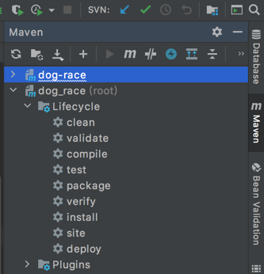

# 技术框架
* 核心框架：Spring boot2.1.6
* 安全框架：Apache Shiro 1.2
* 持久层框架：MyBatis Plus
* 数据库连接池：Alibaba Druid 1.0
* 日志管理：SLF4J 1.7、Log4j
* JS框架：Vue 2.5.1，iview，layer 3.0.3，jquery 2.2.4，jqgrid 5.1.1 
* CSS框架：Twitter bootstrap3.3.7。
* 富文本：froala_editor1.2.2

# 开发环境
建议开发者使用以下环境，这样避免版本带来的问题
* IDE:IDEA
* DB:Mysql5.8
* JDK:JAVA8
* CACHE:Redis4.0

# 打包流程
建议用idea打包
* 修改 application.yml 文件，切换端口号为：1100，切换打包环境为：prod
* 点击idea右侧菜单栏Maven->dog_race(root)->Lifecycle->install（如下图所示）

# 运行环境
* 数据库服务器：Mysql5.8
* 操作系统：Windows、Linux、Unix 等
